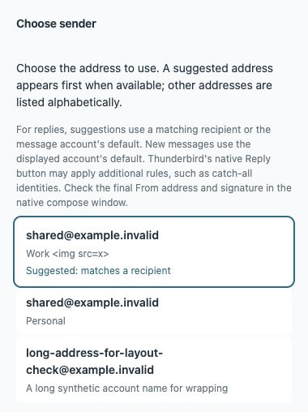

# Sender context correction, 6 October 2026

## Reproduced defect

The previous recipient matcher took the first angle-bracket pair from a mailbox string. For a valid quoted display name such as `"Ops <me@personal.test>" <Alias@Work.test>`, it suggested the Personal identity instead of the actual Work alias. Grouped and multiple mailbox strings could also be misread. This was reproduced in test-first fixtures at the native API boundary. No real mailbox was used to construct or run these tests.

Core 0.1.7 uses Thunderbird's supported `messengerUtilities.parseMailboxString(value, false)` and compares only nonempty parsed email fields. To/Cc/Bcc values are parsed together, groups are flattened, and message-account matching still wins over other accounts. The boolean form is compatible with the minimum supported Thunderbird 140. Parser failure/unavailability falls back to the known message-account default without a display-name guess. Missing parsed emails cannot match an empty identity. Explicit choices, fresh selection validation and native compose details remain intact.

The installed source/schema confirms the native header parser, default-first account identity order and no mailing-list expansion for this call. Thunderbird documents this utility as the parser for [mailbox header strings](https://github.com/thunderbird/webext-docs/blob/beta-mv2/messages.rst) and [mailbox parsing](https://github.com/thunderbird/webext-docs/blob/beta-mv2/messengerUtilities.rst). The installed source hashes and exact package/install identity are recorded in the [build record](../builds/2026-10-06-identities.json).

## Frontend change

The chooser now presents the address, account and suggestion reason on separate lines as inert text. Distinct identities with the same address remain distinguishable by account. The hint describes reply and new-message context without promising parity with every native catch-all rule, and asks the user to check native From/signature. Native signatures are retained; no custom signature library or account setting is added.

## Verification

Seven new regressions failed on the original product behavior. All 17 focused identity/UI tests pass, and the full 162 Node plus 21 Python suite passes with resource/package and whitespace checks. The old audit alias fixture initially lacked the native parser; it now models that documented boundary. Tests exercise Thunderstream matching/selection with native API response fixtures, not the native parser implementation itself.

Independent final review found no actionable defects. A rendered production chooser with synthetic runtime/port data verified initial suggested focus, Enter/Tab/Space, distinct chosen identity IDs for duplicate email addresses, inert markup-like account names, long wrapping, retry after a synthetic failure and no-identities feedback. The fixture never opens compose or sends mail. Its deliberate failure response qualifies request/retry behavior only.

Reproduce:

```sh
python3 scripts/identity-page-fixture.py /private/tmp/thunderstream-identity-page
python3 -m http.server 8767 --bind 127.0.0.1 --directory /private/tmp/thunderstream-identity-page
```

Open `http://127.0.0.1:8767/identities.html?token=fixture`; append `&empty` for the empty state. Runtime boundary and logs are test-only and are not packaged.



## Deployment and remaining native qualification

The 0.1.7 XPI matches source and installed bytes. Updated only the stopped disposable test profile, retained the prior core for rollback, restarted its exact path and verified startup metadata: version 0.1.7, active, userDisabled/appDisabled false. Themes and helper remain at their existing revisions. No new permissions, identity/account/signature settings, real mailbox actions or sending were performed.

Native window selection still resolves the regular-profile process. Actual configured alias selection, per-identity signature switching, native new/reply/reply-all/forward behavior and the 0.1.6 search-page interaction remain open. Startup metadata and synthetic browser tests do not close those checks. Keep the regular profile outside qualification. Public release remains v0.1.2; this work is delivered through draft PR #5 and the disposable profile.
