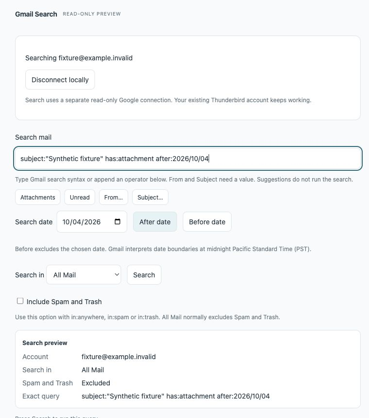

# Read-only search convenience, 6 October 2026

## Delivered contract

Core 0.1.6 adds explicit Attachments, Unread, From and Subject operators, a native date input with After/Before buttons, and an inert preview of account, returned label scope, Spam/Trash setting and exact query. Suggestions append at the end and preserve existing bytes. They never submit automatically. Accepted suggestions use the existing edit path to clear results/pagination and invalidate pending search/open generations. They are disabled while disconnected or composing, and reject over-limit query changes.

The Gmail query, label ID, account, pagination and exact server-copy retrieval service are unchanged. Google access remains optional and read-only. The date hint follows Google's [Gmail API filtering guide](https://developers.google.com/workspace/gmail/api/guides/filtering), including its documented PST boundary. Native aliases, mailbox triage and Gmail label mutations are separate contracts.

## Automated evidence

Eight new page behaviors failed on the original page; the existing scope-invalidation regression passed. The nine tests now pass. A caret fixture expectation was corrected from 38 to 36, the exact length of the asserted literal string. The full suite passes 155 Node and 21 Python tests, plus resource/package validation and whitespace checks. [Build record](../builds/2026-10-06-search.json) binds source, packages, install and logs.

## Rendered production page fixture

The fixture copies production HTML/JS/CSS and injects only the synthetic messenger boundary plus visible test controls/log. It performs no Google/helper/mail access. Actual browser input verified operators, dates, returned label scope, literal outgoing query, keyboard Enter/Space, pagination and stale-response rejection. Markup-like query/result strings remain text and create no image elements. Disconnected controls are disabled. At 375px client width, scroll width remains 375px and the preview uses one column. The screenshot is synthetic browser evidence, not native Thunderbird qualification.

Independent review found one minor invalid selector. Its fix changed the measured operator gap from 12px to 8px. No further actionable defects were found.

Reproduce the fixture:

```sh
python3 scripts/search-page-fixture.py /private/tmp/thunderstream-search-page
python3 -m http.server 8766 --bind 127.0.0.1 --directory /private/tmp/thunderstream-search-page
```

Open `http://127.0.0.1:8766/gmail-search.html`. `?disconnected` exercises disabled controls. A query containing `delayed` waits for Release delayed response, allowing an intervening edit/suggestion to invalidate the response. The fixture exists only under tests and temporary output; it is not packaged in the extension.



## Deployment and native limitation

Updated only the named disposable profile while its process was stopped, with the previous core retained as a rollback copy. The installed core is byte-identical to the source-matching 0.1.6 package. After restart, Thunderbird's extension metadata reports version 0.1.6, active, with userDisabled/appDisabled false. Themes/helper source and permissions are unchanged.

The computer tool repeatedly selected the regular-profile window while the separate disposable-profile process was running. No regular-profile mail interaction or deployment was performed. Native search-page interaction for 0.1.6 remains open until the test window can be selected reliably. Startup metadata proves loaded extension identity, not native clickthrough or live OAuth recovery. The earlier 0.1.5 native navigation evidence remains historical qualification, not a claim that this UI change was tested natively.

Public release remains v0.1.2. The development destination is draft PR #5. Live authentication recovery, actual IME/VoiceOver and remaining Send & Archive failures stay open.
